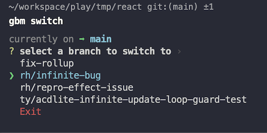
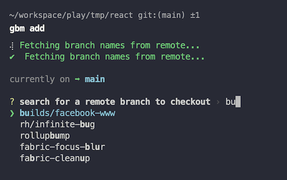

# git-branch-manager

Simple CLI to conveniently switch, remove and checkout remote branches without having to type out full branch names.
It also has a few other shorthand commands that I find helpful.

As of v3, it is written in Rust.

## Get started

> This will only will work with Node 16 and above

```bash
npm install -g @jithyan/git-branch-manager
```

Now you can run it by calling `gbm`.

## How to use

1. `cd` into a `git` repo.
2. Run `gbm <command>`

## Available commands

### switch (sw)

Allows you to select a local branch to switch to. Equivalent to running `git checkout <selected_branch_name>`.

Example:

`gbm switch`



### remove (rm)

Allows you to select a branch that is checked out locally to remove. Equivalent to running `git branch -D <selected_branch_name>`.

Example:

`gbm remove`


### add

Allows you to filter branches from remote and select a branch to checkout locally. Equivalent to running `git fetch && git checkout <selected_branch_name>`.

Example:

`gbm add`



### rb <branch_name>

Equivalent to running `git fetch && git pull origin <branch_name> -r`

Example:

`gbm rb main`


### pff

Equivalent to running `git fetch && git pull --ff-only`

Example:

`gbm pff`


### ct <branch_name>

Transfer **all** changes in the current branch (tracked and untracked) to a new branch and commit it with the message "initial commit".

Equivalent to running:

```sh
git add .
git stash
git checkout -b <branch_name>
git stash pop
git add .
git commit -m "initial commit"
```

Example:

`gbm ct fix-bug`


