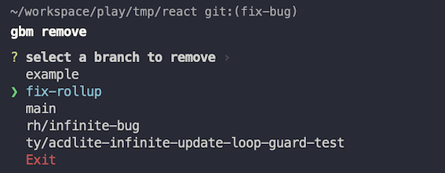

# git-branch-manager

Simple CLI to avoid typing out full git branch names for switching or deleting branches.

## Get started

1. `git clone https://github.com/jithyan/git-branch-manager.git`
2. `cd git-branch-manager`
3. `yarn`
4. `npm install -g .`

Now you can run it by calling `gbranch`.

> If you run into trouble running `yarn` in a corporate proxy, you will have to update `.yarnrc.yml` to add ca-certs and proxy config. See the [yarn docs for more info](https://yarnpkg.com/configuration/yarnrc).

## How to use

1. `cd` into a `git` repo.
2. Run `gbranch <command>`

### Available commands

#### switch

Allows you to select a branch that is checked out locally to switch to. Equivalent to running `git checkout <selected_branch_name>`.

Example:

`gbranch switch`

#### remove

Allows you to select a branch that is checked out locally to remove. Equivalent to running `git branch -D <selected_branch_name>`.

Example:

`gbranch remove`

#### add (takes 1 extra string argument, to filter remote branches)

Allows you to filter branches from remote and select a branch to checkout locally. Equivalent to running `git checkout <selected_branch_name>`.
**Note:** The filter argument is a string, not a regular expression.

Example:

`gbranch add fix`

